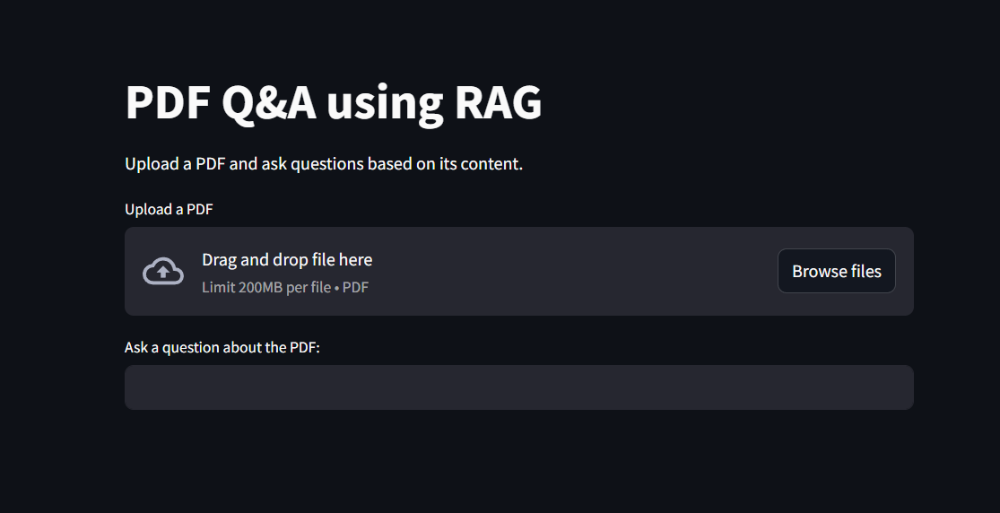

# RAG Document Question Answering System

A Retrieval-Augmented Generation (RAG) based system that allows users
to query PDF documents using natural language.

## Files
- RAG_bot.ipynb – Development notebook
- app.py – Streamlit app for interactive QA

## Tech Stack
Python, LangChain, FAISS, Hugging Face, Streamlit

## Run
streamlit run app.py
## Screenshots

### Streamlit Interface

